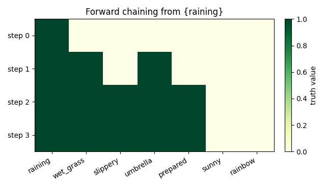

# Forward Chaining: Reasoning as a Differentiable Layer

PolyWeave's `reasoning` module turns a propositional knowledge base into a
**differentiable forward chainer**. You declare facts and Horn-clause rules, and the
chainer repeatedly applies them to a soft truth vector until nothing new is derived —
the deductive closure. Because the premise conjunction is a *product* (a Pi neuron, the
same multiplicative primitive as [`fuzzy_and`](logic-gates.md)), the whole process is
differentiable in the facts.

**On this page:**

- [Build a knowledge base](#build-a-knowledge-base)
- [Chain to the closure](#chain-to-the-closure)
- [Entailment queries](#entailment-queries)
- [Graded truth](#graded-truth)
- [Why differentiable matters](#why-differentiable-matters)

## Build a knowledge base

A [`PropKB`](../api/reasoning.md) holds named facts and rules `and(premises) -> conclusion`.
Atoms are auto-registered the first time they appear:

```python
from polyweave.reasoning import PropKB, ForwardChainer, print_facts

kb = PropKB()
kb.add_rule(["raining"], "wet_grass")
kb.add_rule(["wet_grass"], "slippery")
kb.add_rule(["raining"], "umbrella")
kb.add_rule(["umbrella"], "prepared")
kb.add_rule(["wet_grass", "sunny"], "rainbow")   # a conjunction
```

## Chain to the closure

Give the chainer an initial truth vector and it iterates to the fixpoint:

```python
chainer = ForwardChainer(kb, max_steps=10)
closure, history = chainer(kb.initial_facts(["raining"]), return_history=True)
print_facts(closure, kb)
print(f"converged in {len(history) - 1} steps")
```

```text
  [x] raining                1.0000
  [x] wet_grass              1.0000
  [x] slippery               1.0000
  [x] umbrella               1.0000
  [x] prepared               1.0000
  [ ] sunny                  0.0000
  [ ] rainbow                0.0000
converged in 3 steps
```

From `raining` alone the chainer derives the whole consequent chain
(`wet_grass -> slippery`, `umbrella -> prepared`). `rainbow` stays false because its
rule also needs `sunny`, which was never asserted.

`polyweave.viz` turns the step history into a picture of the propagation:

```python
from polyweave.viz import plot_chaining_trace

plot_chaining_trace(history, kb.fact_names, "chaining_trace")
```



Each row is a chaining step (top = initial facts); a cell turns green as its fact becomes
true. `raining` fires `wet_grass` and `umbrella`, which in turn fire `slippery` and
`prepared`; `sunny` and `rainbow` stay pale because `sunny` was never asserted.

## Entailment queries

For propositional Horn clauses, forward chaining to the fixpoint is **sound and
complete for entailment** — so a goal is entailed exactly when its truth crosses the
threshold. The `entails` helper wraps that:

```python
f0 = kb.initial_facts(["raining"])
chainer.entails(f0, "prepared")   # (True, 1.0)
chainer.entails(f0, "rainbow")    # (False, 0.0)
```

## Graded truth

Truth values are soft, so partial evidence propagates. With the product t-norm, a
chain of single-premise rules passes its input through unchanged:

```python
f = kb.initial_facts([])
f[0, kb.idx("raining")] = 0.7
print_facts(chainer(f), kb)        # wet_grass, slippery, umbrella, prepared all = 0.7000
```

The two t-norms differ on a *conjunction*. With `wet_grass = 0.5` and `sunny = 0.6`:

```python
f = kb.initial_facts([])
f[0, kb.idx("raining")] = 0.5      # -> wet_grass = 0.5
f[0, kb.idx("sunny")]   = 0.6
ForwardChainer(kb, t_norm="product")(f)[..., kb.idx("rainbow")]   # 0.30  (0.5 * 0.6)
ForwardChainer(kb, t_norm="min")(f)[..., kb.idx("rainbow")]       # 0.50  (min(0.5, 0.6))
```

`product` is the smooth, Sigma-Pi-flavoured conjunction (gradient through *both*
premises); `min` is crisp Gödel logic.

## Why differentiable matters

Because every step is built from products and maxes, gradients flow back through the
entire reasoning chain to the input facts:

```python
import torch
f = kb.initial_facts([])
raining = torch.tensor(0.8, requires_grad=True)
f = f.clone(); f[0, kb.idx("raining")] = raining

chainer(f)[..., kb.idx("slippery")].backward()
print(raining.grad.item())         # 1.000
```

That derivative — how much `slippery` depends on `raining` — is computed *through* the
two-hop proof. The practical consequence: this chainer is a **reasoning layer**. You can
backpropagate a downstream loss into the facts that feed it, or place it inside a larger
network so that part of the model's computation is explicit, auditable deduction rather
than an opaque MLP. (Rule structure is frozen here; making the rule masks learnable —
soft rule induction — is the natural next step, and the basis for learning logic
programs end-to-end.)
